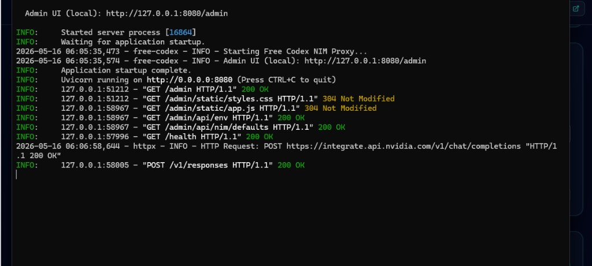
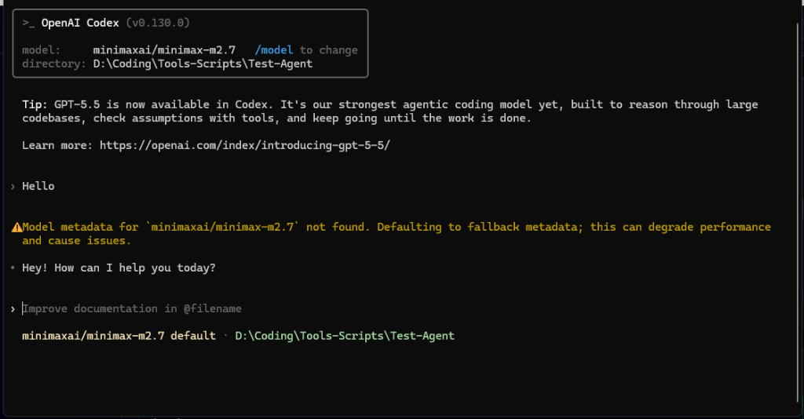
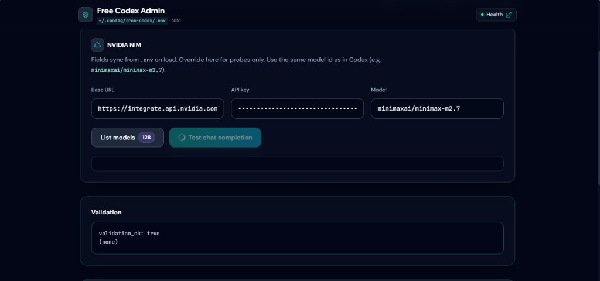
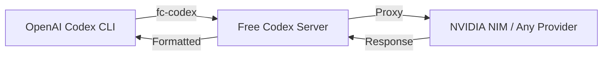

# Free Codex

<p align="center">

[](https://www.python.org/downloads/)
[](https://github.com/astral-sh/uv)
[](https://fastapi.tiangolo.com/)
[](https://opensource.org/licenses/MIT)
[](#)

</p>

<p align="center">
  <b>OpenAI Codex CLI for your own hosted models</b><br>
  A lightweight, self-hosted API layer that brings Codex tooling to NVIDIA NIM and any OpenAI-compatible endpoint.
</p>

---

</p>

</details>

---

## Features

| Feature | Description |
|---------|-------------|
| **OpenAI-Compatible API** | Drop-in `/v1/chat/completions`, `/v1/models`, `/v1/responses` endpoints |
| **Any Provider** | Works with NVIDIA NIM, Ollama, vLLM, or any OpenAI-compatible API |
| **Codex Tool Support** | Full tool-calling and workspace context integration |
| **Admin Dashboard** | Beautiful web console at `/admin` for config and testing |
| **Model Sync** | Automatic model alignment between Codex and your provider |
| **Live Reload** | Development mode with instant Python + UI refresh |
| **Cross-Platform** | Linux, macOS, and Windows support |

---

## Quick Start

### Prerequisites

- Python 3.9+
- [uv](https://docs.astral.sh/uv/) package manager
- An OpenAI-compatible API endpoint + key (e.g., [NVIDIA NIM](https://docs.nvidia.com/nim/))
- [OpenAI Codex CLI](https://developers.openai.com/codex/) installed

### 1. Install Dependencies

```bash
# Install uv (pick your platform)
# Linux/macOS:
curl -LsSf https://astral.sh/uv/install.sh | sh
# Windows:
powershell -ExecutionPolicy ByPass -c "irm https://astral.sh/uv/install.ps1 | iex"

# Install Codex CLI
npm install -g @openai/codex
codex --version
```

### 2. Install Free Codex

```bash
# Clone the repository
git clone https://github.com/MurShidM01/free-codex.git
cd free-codex

# Install dependencies
uv sync

# Initialize configuration
uv run fc-init
```

### 3. Configure Your Provider

Edit `~/.config/free-codex/.env`:

```env
NVIDIA_NIM_BASE_URL=https://integrate.api.nvidia.com/v1
NVIDIA_NIM_API_KEY=your_api_key_here
NVIDIA_NIM_MODEL=your_org/your-model-id
```

> **Tip:** Open `http://127.0.0.1:8080/admin` in your browser for a visual config editor.

### 4. Start the Server

```bash
# Run with live reload (recommended for development)
FREE_CODEX_RELOAD=1 uv run fc-server

# Or run directly
uv run fc-server
```

Server runs at **`http://127.0.0.1:8080`** with health check at `http://127.0.0.1:8080/health`

### 5. Run Codex CLI

```bash
# In a new terminal
uv run fc-codex
```

---

## Demo

<p align="center">
  
</p>

<p align="center">
  
</p>

<p align="center">
  
</p>

---

## Environment Variables

| Variable | Default | Description |
|----------|---------|-------------|
| `NVIDIA_NIM_BASE_URL` | - | Provider base URL (required) |
| `NVIDIA_NIM_API_KEY` | - | API key (required) |
| `NVIDIA_NIM_MODEL` | - | Default model ID |
| `FREE_CODEX_PORT` | `8080` | Server port |
| `FREE_CODEX_HOST` | `0.0.0.0` | Bind address |
| `FREE_CODEX_RELOAD` | `0` | Enable auto-reload (`1`/`true`/`on`) |
| `FREE_CODEX_ACCESS_LOG` | `0` | Enable request logging |
| `FREE_CODEX_SSE_DELTA_CHARS` | - | SSE chunk size cap |
| `FREE_CODEX_LOG_LEVEL` | `info` | Logging level |
| `FREE_CODEX_ADMIN_TOKEN` | - | Bearer token for admin endpoints |
| `FREE_CODEX_WORKSPACE_CONTEXT` | - | Workspace hints for `/v1/responses` |
| `FREE_CODEX_WORKSPACE_ROOT` | - | Default workspace directory |
| `FREE_CODEX_WORKSPACE_SNIPPET_BYTES` | - | Snippet size cap (bytes) |
| `FREE_CODEX_WORKSPACE_SNIPPET_LINES` | - | Snippet size cap (lines) |

---

## Development

### Running Locally

```bash
# With live reload (watches Python + admin files)
FREE_CODEX_RELOAD=1 uv run fc-server

# Production-like (no reload)
uv run fc-server
```

### Project Structure

```
free-codex/
├── src/free_codex/
│   ├── routes/          # API endpoint handlers
│   ├── services/       # Business logic
│   ├── utils/          # Utilities
│   ├── app.py          # FastAPI application
│   ├── cli.py          # CLI entry point
│   ├── cli_server.py   # Server CLI
│   └── cli_codex.py    # Codex wrapper CLI
├── src/free_codex/static/admin/  # Admin dashboard
└── pyproject.toml      # Project configuration
```

### Available Commands

| Command | Description |
|---------|-------------|
| `uv run fc-init` | Initialize configuration |
| `uv run fc-server` | Start the API server |
| `uv run fc-codex` | Run Codex CLI with Free Codex config |
| `uv run pytest` | Run test suite |

---

## Security

> **Warning:** Binding to `0.0.0.0` exposes your API and admin panel. Use `FREE_CODEX_ADMIN_TOKEN`, TLS, and firewall rules in production environments.

- **Local development:** Use `http://127.0.0.1:8080` (loopback only)
- **Production:** Set `FREE_CODEX_ADMIN_TOKEN` for secure admin access
- **Do not** use `FREE_CODEX_RELOAD` in production

---

## Troubleshooting

### Changes don't apply after editing files?

`uv tool install` creates an **isolated copy** of the project. Your git clone edits won't affect the installed tool.

**Fix:**
1. Run `uv tool install . --force` from your clone directory, or
2. Use `FREE_CODEX_RELOAD=1 uv run fc-server` during development

### Windows SSE errors on close?

Benign `WinError 10054` on SSE client disconnect is filtered from error logs — this is expected behavior.

### Server won't start after .env changes?

Restart `fc-server` to reload environment variables (not needed with `FREE_CODEX_RELOAD=1`).

---

## How It Works

Free Codex sits between the OpenAI Codex CLI and your hosted models:



The server translates Codex tool calls into OpenAI-compatible API requests and formats responses back into Codex format.

---

## Contributing

Contributions are welcome! Please feel free to submit a Pull Request.

1. Fork the repository
2. Create your feature branch (`git checkout -b feature/amazing-feature`)
3. Commit your changes (`git commit -m 'Add amazing feature'`)
4. Push to the branch (`git push origin feature/amazing-feature`)
5. Open a Pull Request

---

## License

This project is licensed under the MIT License - see the file for details.

---

<p align="center">
  <sub>Built with</sub>
  <br>
  <a href="https://fastapi.tiangolo.com/"></a>
  <a href="https://github.com/astral-sh/uv"></a>
</p>

<p align="center">
  <a href="https://github.com/MurShidM01/free-codex">GitHub</a>
  ·
  <a href="https://github.com/MurShidM01/free-codex/issues">Issues</a>
  ·
  <a href="https://github.com/MurShidM01/free-codex/discussions">Discussions</a>
</p>
